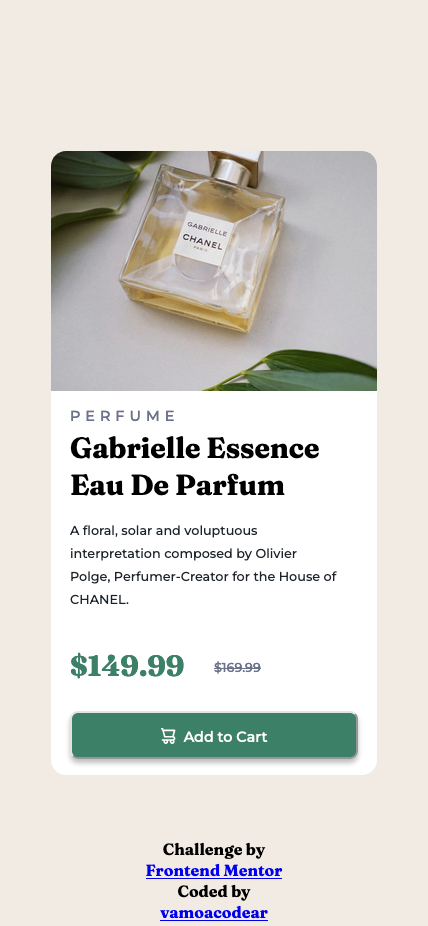

# Frontend Mentor - Product preview card component solution

This is a solution to the [Product preview card component challenge on Frontend Mentor](https://www.frontendmentor.io/challenges/product-preview-card-component-GO7UmttRfa). Frontend Mentor challenges help you improve your coding skills by building realistic projects.

## Table of contents

- [Overview](#overview)
  - [The challenge](#the-challenge)
  - [Screenshot](#screenshot)
  - [Links](#links)
- [My process](#my-process)
  - [Built with](#built-with)
  - [What I learned](#what-i-learned)
  - [Continued development](#continued-development)
  - [Useful resources](#useful-resources)
- [Author](#author)
- [Acknowledgments](#acknowledgments)

**Note: Delete this note and update the table of contents based on what sections you keep.**

### The challenge

Users should be able to:

- View the optimal layout depending on their device's screen size
- See hover and focus states for interactive elements

### Screenshot

### Links

- Solution URL: [Github repo](https://github.com/nsdonato/mentor_productcard)
- Live Site URL: [Demo](https://your-live-site-url.com)

### Built with

- Semantic HTML5 markup
- CSS custom properties
- Flexbox
- CSS Grid
- Mobile-first workflow

### Useful resources

- [Codely Tv](https://pro.codely.com/library/css-grid-a-fondo-126731/307888/about) - I learned CSS Grid with this course and wanted to apply it in this challenge..

## Author

- Github - [Github](https://github.com/nsdonato)
- Frontend Mentor - [@nsdonato](https://www.frontendmentor.io/profile/yourusername)
- Twitter - [@vamoacodear](https://www.twitter.com/vamoacodear)

## Acknowledgments
You need to practice what you learn!
